# SoftwareDesignFinal_AusserlechnerM_WalserN


## Überblick
Dieses Programm ist im Rahmen des Abschlussprojekts der Lehrveranstaltung „Softwaredesign“ entstanden.

Die Anwendung ermöglicht die Modellierung von Strukturen aus Massepunkten und Federn in verschiedenen Formen. Konkret können rechteckige Balken mit variablen Abmessungen generiert, eigene Zeichnungen direkt in der Benutzeroberfläche erstellt oder Bilder (bis zu einer Größe von 120x120 Pixeln) importiert werden. Diese Modelle lassen sich anschließend mit Lagerbedingungen sowie äußeren und inneren Kräften beaufschlagen.

Für die gewählten Randbedingungen kann eine Verformungssimulation als auch eine Topologieoptimierung durchgeführt werden. Hierfür stehen verschiedene konfigurierbare Algorithmen zur Verfügung.

Zudem bietet das Programm die Möglichkeit, Projekte zu speichern und zu laden. Die Berechnungsverläufe können als GIF und die finalen Ergebnisse als PNG-Datei exportiert werden.
[Web-App öffnen](https://softwaredesignfinalausserlechnermwalsern-ccey8jddd9wmlb2ztqgtd.streamlit.app/)
## Installation und Ausführung
### 1. Repository clonen
```bash
git clone https://github.com/Froggy875/SoftwareDesignFinal_AusserlechnerM_WalserN.git
cd SoftwareDesignFinal_AusserlechnerM_WalserN/
```
### 2. Virtuelle Umgebung erstellen und aktivieren (Empfohlen)
Es ist wird empfohlen, eine virtuelle Umgebung (`venv`) zu nutzen, um Konflikte mit anderen Python-Projekten auf deinem System zu vermeiden.

**Unter Windows:**
```bash
python -m venv .venv
.venv\Scripts\activate
```

**Unter macOS / Linux:**
```bash
python3 -m venv .venv
source .venv/bin/activate
```

*(Wenn die Aktivierung erfolgreich war, ist `(.venv)` vorne in der Kommandozeile sichtbar).*

### 3. Abhängigkeiten installieren
Sobald die virtuelle Umgebung aktiv ist, benötigten Bibliotheken installieren:
```bash
pip install -r requirements.txt
```

### 4. App starten
Mit aktivierter Umgebung und installierten Abhängigkeiten kann die Anwendung nun gestartet werden:

```bash
streamlit run .\src\main.py
```

*(Die Web-App öffnet sich danach automatisch in deinem Standard-Browser).*

## UML-Diagramm 
[![](https://mermaid.ink/img/pako:eNq1WOtOIzcUfhVrtCslJaQESggRWqmwqy7dbqka-qeKZHlmPJOzeOyR7VDClrfpm_TFeuyZSTyToaBK5UcwPhefy3cu4WuUqJRH8ygRzJj3wHLNiqUk-PP2LblSmpMPghdcWlPdej7yMwqRr9WN-zkAaQmkwYUsx0xrtiGlMn3XmdIJDwgCjCUZPPBeJSmYUrDEG1LRn5YyNGhRapB5y6RMKGZJyqUBu9m7L7lkouf-LrjJuaUpaJ5YUHIwJHZditDmT1SohAmkFMxqeGiRcqHifppTa6xmICmXXOcbZPKPdzzDBCysXid2jVn4zCTLA_9rt7f0wPNDikksV0Q-jH9wh-BplqZUYu4G7oNCOiL-oOIvww6X8QFt-CjUnHj8MiIVsSvm_AqVDz1Muo4_r3dYZzGQ0LxQ97yttedFgxF0AOqQeJo_R_IRQlI3QHJdxFxTlW31grS99EZ5m24VIiaxeO9-hTE1hhex4NRsjOVFD5qMEvcc7z3i-0HeZPtyDSLlOkz6xYWxzELy7l0IhERJifClkkO-ipU2A9PoqANfsHL4JrAi0ZxZTh3omcwFhp2WCn009A-UaM6r4ZudNfvSmVYFajZ3A_dBj1PqndoXCrF-U1oo4JHrVqe5ZIbfqlIJlW-2HK0639WA6bHINyYJFpioUooxWbdSRn3gd3mJlRIhWfM66TUiQlrsEoEZx9jLBP0GYbkeACrCZ5ROQWI4zIhoWoAMMdHJ7IfFDXWe9ntIsckka-Ei63PmuwZ49HVQRsFQXzMsFkEddl1KVjy5a8AB99gfK15Eb1VxPSJbEyr9oopjWAA9Pn1kOv0EQtB-xwy3pHqwakumk7hkrTH6lmJANXNNOKCrWuPAMu0qGpGGvjuuEbbch52MGZLcRYxZpZ81dKEy-4KhBlnoHfL0GOvSUNWTq8L_5sd4PN6ztKridZm6wNdd11jIMsmxn5hBxhLkHYbMpeYl01ssVsgLGVhZik09eRquFqz-BaeL68-_PBOil_ysxmvDsT9-fQiVqyY_saEVxFcE6ZV-m0q7w3zDurvqON-K_tYsqpK2yIjUEKzRh2O9Xpla7-8qKFlha-V7U9_92nbD3ywIr518S94zy2LsDmEmmrurqohVZxgswDVvq2R7HoCsOtW-eDgDsI-SktlwLt6C3Ly_JGncmaPWNxr_SSUrsHH4cz94uMYu3AXOxYVF3WmMmanIHjiN2R0VaDbvV3NgNyUnN5c_0qufvl8sAgKXbsUduGXFTYgQctxTXM5Rb--Dt1D8Lw8inHlP4qtHrwtc9T48lErbl4f8QQa5a9wliAEeccZ68e6-AxmNN9a1DFzwHWbTdVWiKOAJHQFwShoRrzbges7m6-KVNtd7gl8RQJZr3LMRkFhIK83NCrsA2sf0nRtnuD77-KMFfZsRlsqvXFSNfgVlbWD9dWAZTZYRUYeHeDrGk__aMif3XMcgU16X3m6B-AY5ax4s39Xff4lellr7s0zNejYevwsk56SqvkcArm0Ywf4dx5kdShcqhQwed8L9Yhd_otzePvGiRLuzh9bt7ybbJ_bH-4si-4O2yWRQZp67Xev9PJ3yrJj2W6NLRKd1zHHxyHFv07t49st1nmjJRaMo15BGc0wTH0UF1wVzf0Ye_8vIrnAOLKM5Hh2cl9FSPqFMyeTvShWNmFbrfBXNMyYM_lWNm_qb-JaFI1z1ldu4ovns6NzriOZfo4doPpmcjU_OzyZnRyfTo-Oj6WQ2ijbR_HhyOp6dnU9ms-nk9PRkejZ7GkWP_tmj8Ww6O5kdTSbTs_PvTo-nKMFTQI8_1_8McL-e_gHz1iz4?type=png)](https://mermaid.live/edit#pako:eNq1WOtOIzcUfhVrtCslJaQESggRWqmwqy7dbqka-qeKZHlmPJOzeOyR7VDClrfpm_TFeuyZSTyToaBK5UcwPhefy3cu4WuUqJRH8ygRzJj3wHLNiqUk-PP2LblSmpMPghdcWlPdej7yMwqRr9WN-zkAaQmkwYUsx0xrtiGlMn3XmdIJDwgCjCUZPPBeJSmYUrDEG1LRn5YyNGhRapB5y6RMKGZJyqUBu9m7L7lkouf-LrjJuaUpaJ5YUHIwJHZditDmT1SohAmkFMxqeGiRcqHifppTa6xmICmXXOcbZPKPdzzDBCysXid2jVn4zCTLA_9rt7f0wPNDikksV0Q-jH9wh-BplqZUYu4G7oNCOiL-oOIvww6X8QFt-CjUnHj8MiIVsSvm_AqVDz1Muo4_r3dYZzGQ0LxQ97yttedFgxF0AOqQeJo_R_IRQlI3QHJdxFxTlW31grS99EZ5m24VIiaxeO9-hTE1hhex4NRsjOVFD5qMEvcc7z3i-0HeZPtyDSLlOkz6xYWxzELy7l0IhERJifClkkO-ipU2A9PoqANfsHL4JrAi0ZxZTh3omcwFhp2WCn009A-UaM6r4ZudNfvSmVYFajZ3A_dBj1PqndoXCrF-U1oo4JHrVqe5ZIbfqlIJlW-2HK0639WA6bHINyYJFpioUooxWbdSRn3gd3mJlRIhWfM66TUiQlrsEoEZx9jLBP0GYbkeACrCZ5ROQWI4zIhoWoAMMdHJ7IfFDXWe9ntIsckka-Ei63PmuwZ49HVQRsFQXzMsFkEddl1KVjy5a8AB99gfK15Eb1VxPSJbEyr9oopjWAA9Pn1kOv0EQtB-xwy3pHqwakumk7hkrTH6lmJANXNNOKCrWuPAMu0qGpGGvjuuEbbch52MGZLcRYxZpZ81dKEy-4KhBlnoHfL0GOvSUNWTq8L_5sd4PN6ztKridZm6wNdd11jIMsmxn5hBxhLkHYbMpeYl01ssVsgLGVhZik09eRquFqz-BaeL68-_PBOil_ysxmvDsT9-fQiVqyY_saEVxFcE6ZV-m0q7w3zDurvqON-K_tYsqpK2yIjUEKzRh2O9Xpla7-8qKFlha-V7U9_92nbD3ywIr518S94zy2LsDmEmmrurqohVZxgswDVvq2R7HoCsOtW-eDgDsI-SktlwLt6C3Ly_JGncmaPWNxr_SSUrsHH4cz94uMYu3AXOxYVF3WmMmanIHjiN2R0VaDbvV3NgNyUnN5c_0qufvl8sAgKXbsUduGXFTYgQctxTXM5Rb--Dt1D8Lw8inHlP4qtHrwtc9T48lErbl4f8QQa5a9wliAEeccZ68e6-AxmNN9a1DFzwHWbTdVWiKOAJHQFwShoRrzbges7m6-KVNtd7gl8RQJZr3LMRkFhIK83NCrsA2sf0nRtnuD77-KMFfZsRlsqvXFSNfgVlbWD9dWAZTZYRUYeHeDrGk__aMif3XMcgU16X3m6B-AY5ax4s39Xff4lellr7s0zNejYevwsk56SqvkcArm0Ywf4dx5kdShcqhQwed8L9Yhd_otzePvGiRLuzh9bt7ybbJ_bH-4si-4O2yWRQZp67Xev9PJ3yrJj2W6NLRKd1zHHxyHFv07t49st1nmjJRaMo15BGc0wTH0UF1wVzf0Ye_8vIrnAOLKM5Hh2cl9FSPqFMyeTvShWNmFbrfBXNMyYM_lWNm_qb-JaFI1z1ldu4ovns6NzriOZfo4doPpmcjU_OzyZnRyfTo-Oj6WQ2ijbR_HhyOp6dnU9ms-nk9PRkejZ7GkWP_tmj8Ww6O5kdTSbTs_PvTo-nKMFTQI8_1_8McL-e_gHz1iz4)

## Komponentendiagramm
[![](https://mermaid.ink/img/pako:eNqVVmtv4jgU_StWRjNqJSjlDdnVSAVKhdQWtEz7YYYVMokBb4Md-dEWmv73vbaTQCij3SIBtjn33OtzH-HNC3hIPN9bRvwlWGOh0I_BjCF4ff2KpmobUbZy-yDCUg7IEkkFMAZmaEmjyP8S1mvL2rIkleBPxP-yaFeDapBuyy80VGu_Fr-WAh5x4b-sqSJ_HDFqmlI1-lfD5mVOVe90ruv9T1HFNCYQcxZbrdptDes5YbXbbg1qnyIMuMjIhsNu53If3bDZ7ufb_0cWLlKqbr_W7u2p2r3q8OpzcWlFI5mytS7bg04vZ2s0m1etxn-x5Vm-imN0zZTYogmnTLnzO0zZkEbk18zbwPIi3qKzI-D5zPvb9_28HDJKqRcrgeM1GgrOFGEhApJ8XUEPI3Q2VYLgTUQtiTMzr4cRQAO-iTkjTEnw-udCfDeOy1NFNBGardA39EjJi0zda7o3f6QS7J-p1DiiOyIye_Cmn5QW5UnE1bEhBPUh8klWRUCXr8_6cAXBo4iIYtR9HAUGZWKHpY6wopzNs1LMoriGVsILEmLQAUU4hE-4ChcLIgikhKVxZWZ7_p6mUTjl0bPxsDCbOWbhXJqTOWRZB3A3cnxZtCKMCArkv2cex-qW8xhoeazoBjT7yDe2v1jpZXkarCNCl-Qk4ykl-6Z9gN9-3-ItEehswE1JoVu-okFRSXtTIgCfh5EeQTTOpenHvcHUwg7xplK_IRKRTVpBJ82MdNaNXWRXvYG7BWtzUbmVChjOTxmPU6nEgWz7UhvdTUroejr-YHpKndHYaDOqjAsqjDarEYNzusErMqfQDUIdKGA7v4Aea5XDyevv4adCGGCFF1jaJOVrm6hCTIPeXyTmgAkXcwErSRUX2_TWzlG4OIRDszAHD2BFAoC71Egoyrw9P1r-oGw76P06A9M0mot_JGdW3DuisG0fEPf82PB-8tNYbbASQM7mFlixdhcs3sFEk09wkGcPJgog5DHVgUYwG8vlMuqRHSWmKqBhNUywgSFeRlpK83NxXMLJ92RqJiJRKB9yMNcSeDsojL9DUA8aNFgzS5_ko-QIakYf8KXNl2R9W0Bdix3RK2WGoBl_0rVsYvYF3C0moQJH7BnLykMccRzKxNVc0WtsmsH4vRkNK5P7myQttUyeLFbHakaYctqgF7MRycHgchb7vbXpYQ3kVAG2YrOTZAPgJPyWEwki2M5M0hZ2wFQOixpqsoaYsZbJvlMd7IAVxpABjxg8vdiOglYqSYeJQzl6F6bLEDnwfQDMfVjsIxEYKshmK53De3hR3lTce61MMY5YrBWE7PrslMA2bfmTzApdhB-qkLEXhzfcNSzauE93Yg1v4Fm0VGinQcFlkvZxhjJrFwyFVFSgHgG9AOVc034g25fQXdqViWlTr-StBA09Hy5DSt6GCHgewNZ7MwwzT61h9M48H5kZIJ5m3oy9g02M2U_ON5mZ4Hq19vwljiTsdGz6fUAxTLU9xKaizzVTnl_tNCyH5795r57faV40ut16s13vduqtRrNd8raeX4PTWqPWvWxWm7V6rdt4L3k767R6UW3V661WvdpuN7qXtTqwkdBMwTv3D9r-kX7_Fx-fvQk?type=png)](https://mermaid.live/edit#pako:eNqVVmtv4jgU_StWRjNqJSjlDdnVSAVKhdQWtEz7YYYVMokBb4Md-dEWmv73vbaTQCij3SIBtjn33OtzH-HNC3hIPN9bRvwlWGOh0I_BjCF4ff2KpmobUbZy-yDCUg7IEkkFMAZmaEmjyP8S1mvL2rIkleBPxP-yaFeDapBuyy80VGu_Fr-WAh5x4b-sqSJ_HDFqmlI1-lfD5mVOVe90ruv9T1HFNCYQcxZbrdptDes5YbXbbg1qnyIMuMjIhsNu53If3bDZ7ufb_0cWLlKqbr_W7u2p2r3q8OpzcWlFI5mytS7bg04vZ2s0m1etxn-x5Vm-imN0zZTYogmnTLnzO0zZkEbk18zbwPIi3qKzI-D5zPvb9_28HDJKqRcrgeM1GgrOFGEhApJ8XUEPI3Q2VYLgTUQtiTMzr4cRQAO-iTkjTEnw-udCfDeOy1NFNBGardA39EjJi0zda7o3f6QS7J-p1DiiOyIye_Cmn5QW5UnE1bEhBPUh8klWRUCXr8_6cAXBo4iIYtR9HAUGZWKHpY6wopzNs1LMoriGVsILEmLQAUU4hE-4ChcLIgikhKVxZWZ7_p6mUTjl0bPxsDCbOWbhXJqTOWRZB3A3cnxZtCKMCArkv2cex-qW8xhoeazoBjT7yDe2v1jpZXkarCNCl-Qk4ykl-6Z9gN9-3-ItEehswE1JoVu-okFRSXtTIgCfh5EeQTTOpenHvcHUwg7xplK_IRKRTVpBJ82MdNaNXWRXvYG7BWtzUbmVChjOTxmPU6nEgWz7UhvdTUroejr-YHpKndHYaDOqjAsqjDarEYNzusErMqfQDUIdKGA7v4Aea5XDyevv4adCGGCFF1jaJOVrm6hCTIPeXyTmgAkXcwErSRUX2_TWzlG4OIRDszAHD2BFAoC71Egoyrw9P1r-oGw76P06A9M0mot_JGdW3DuisG0fEPf82PB-8tNYbbASQM7mFlixdhcs3sFEk09wkGcPJgog5DHVgUYwG8vlMuqRHSWmKqBhNUywgSFeRlpK83NxXMLJ92RqJiJRKB9yMNcSeDsojL9DUA8aNFgzS5_ko-QIakYf8KXNl2R9W0Bdix3RK2WGoBl_0rVsYvYF3C0moQJH7BnLykMccRzKxNVc0WtsmsH4vRkNK5P7myQttUyeLFbHakaYctqgF7MRycHgchb7vbXpYQ3kVAG2YrOTZAPgJPyWEwki2M5M0hZ2wFQOixpqsoaYsZbJvlMd7IAVxpABjxg8vdiOglYqSYeJQzl6F6bLEDnwfQDMfVjsIxEYKshmK53De3hR3lTce61MMY5YrBWE7PrslMA2bfmTzApdhB-qkLEXhzfcNSzauE93Yg1v4Fm0VGinQcFlkvZxhjJrFwyFVFSgHgG9AOVc034g25fQXdqViWlTr-StBA09Hy5DSt6GCHgewNZ7MwwzT61h9M48H5kZIJ5m3oy9g02M2U_ON5mZ4Hq19vwljiTsdGz6fUAxTLU9xKaizzVTnl_tNCyH5795r57faV40ut16s13vduqtRrNd8raeX4PTWqPWvWxWm7V6rdt4L3k767R6UW3V661WvdpuN7qXtTqwkdBMwTv3D9r-kX7_Fx-fvQk)

## Beschreibung des UI
### 1. Hauptmenü
Wird die App gestartet, erscheint zuerst das Hauptmenü. Unter "Bestehendes Projekt laden" kann der Nutzer den Fortschritt eines vorher erzeugten Projektes wieder laden. Das Projekt kann anhand der Projektnummer, dem Erzeugungsmodus (Rechteck definiert, gezeichnete Struktur oder Bild hochgeladen) sowie Datum und Uhrzeit der Erstellung identifiziert werden. Hier kann der Nutzer auch gespeicherte Projekte löschen. Beim Drücken des "Projekt laden"-Buttons wird der Nutzer auf die Ergebnisseite weitergeleitet. Die Optimierung kann anschließend fortgesetzt werden.
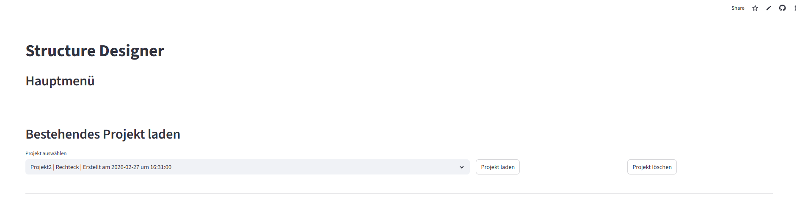
Hinweis: Klickt man oben rechts auf die drei Punkte, kann unter Settings das App-Theme gewählt werden. Für eine bessere Ästhetik wird das Light-Theme empfohlen.

Unter "Neues Projekt" können neue Projekte angelegt werden. Dabei gibt es folgende Möglichkeiten, um eine Struktur zu erstellen:
#### 1. Rechteckige Struktur
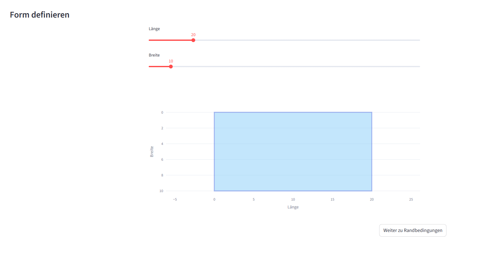
Mithilfe der Schieberegler können Länge und Breite eines Rechtecks definiert werden. Die Geometrie des Bauteils wird dabei in Echtzeit geplottet, um ein direktes visuelles Feedback für die Proportionen zu erhalten.

#### 2. Struktur zeichnen
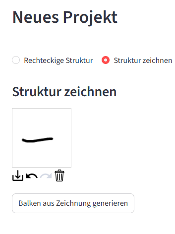

Hier hat der Nutzer die Möglichkeit, eine Struktur frei im Canvas zu erzeugen. 

#### 3. Struktur aus Bild generieren
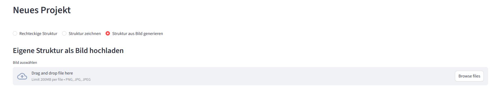
In diesem Abschnitt kann ein Bild hochgeladen oder reingezogen werden, um anschließend eine Struktur aus dem Bild zu generieren.

### 2. Randbedingungen & Belastung
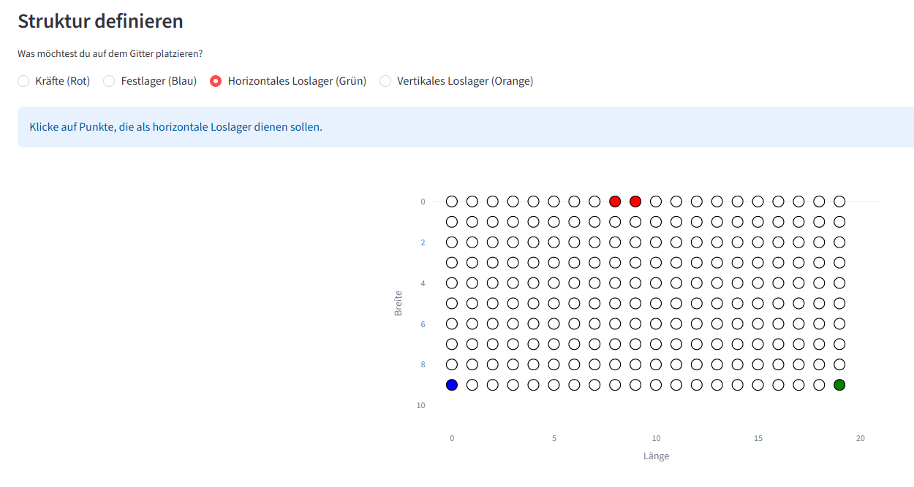
Nachdem die Geometrie des Bauteils festgelegt wurde, können die Randbedingungen bestimmt werden. In diesem Abschnitt werden die Nodes, aus denen das Bauteil später simuliert wird, grafisch dargestellt. Mittels Mausklick auf einen Punkt kann dieser als Kraftpunkt, Festlager, Horizontales Loslager oder Vertikales Loslager bestimmt werden. Wird auf einen bereits ausgewählten Punkt geklickt, wird dieser je nach Auswahl wieder entfernt oder überschrieben.

Für jeden Kraftpunkt kann anschließend der Betrag sowie der Angriffswinkel bestimmt werden.
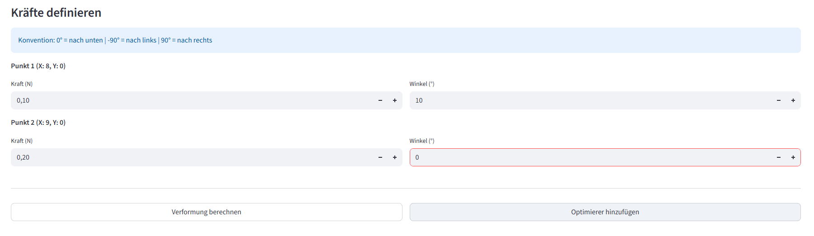

Anschließend kann der Nutzer auswählen, ob er nur die Verformung des Bauteils berechnen will (Weiterleitung zu Ergebnisseite) oder die Bauteilgeometrie zusätzlich optimieren will.

### 3. Wähle den Optimierungsalgorithmus
Hier hat der Nutzer die Möglichkeit, im Drop-Down Menü den gewünschten Optimieralgorithmus auszuwählen. Je nach Auswahl können danach noch verschiedene Parametereinstellungen für den Algorithmus getätigt werden.
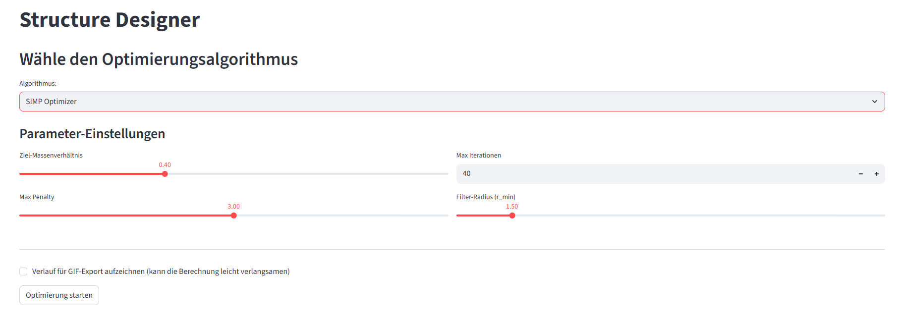
Wird "Verlauf für GIF-Export aufzeichnen" ausgewählt, kann der Optimierungsprozess anschließend auf der Ergebnisseite als GIF gedownloaded werden.

### 4. Rechenvorgang
Beim Drücken des "Optimierung starten"-Buttons wird die tatsächliche Struktur von der App erzeugt und die Optimierung gestartet. Ein Ladesymbol weist darauf hin, dass es bei größeren Strukturen länger dauern kann, bis die Optimierungs-Visualisierung angezeigt werden kann. Der Optimierungsprozess kann durch Drücken des "Stop"-Buttons unterbrochen werden. Der Optimierungsfortschritt kann dann in der Datenbank gespeichert, als PNG gedownloaded oder wieder fortgesetzt werden. Wurde vorher ausgewählt, dass man den Optimierungsprozess als GIF speichern möchte, kann das GIF hier gedownloaded werden. Ist die Optimierung abgeschlossen, erscheint ein dementsprechender Hinweis.
Des Weiteren wird hier die Verformung der optimierten Geometrie sowie die Verformung der ursprünglichen Geometrie geplottet. Auch diese Plots können als PNG gedownloaded werden. Der "Zurück zur Startseite"- Button leitet den Nutzer anschließend wieder zurück ins Hauptmenü.

# TopologieOptimierung
Zur Topologieoptimierung wurden drei Algorithmen ESO_HardKill_Optimizer, ESO_SoftKill_Optimizer und SIMP_Optimizer implementiert. Sie erben alle von der Hauptelternklasse BaseTopologyOptimizer, wobei die beiden ESO Optimizer dies indirekt über eine Subelternklasse ESO_BaseOptimizer tun.

## ESO_HardKill_Optimizer: Evolutionary Structural Optimization Hard Kill Optimizer


### Funktionsweise
Dieser Algorithmus wurde als Grundanforderung nach dem UML-Diagramm von Julian Huber & Matthias Panny implementiert. Er nutzt das „Hard-Kill“-Verfahren, um den Materialanteil einer Struktur iterativ auf ein Zielverhältnis zu reduzieren, indem ineffiziente Knotenpunkte vollständig gelöscht werden.

In jedem Iterationsschritt wird das globale Gleichungssystem $K \cdot u = F$ gelöst und die Verformungsenergie der Knoten berechnet. Die Knoten mit der geringsten Energie werden anschließend entfernt. Zwei Sicherheitsmechanismen garantieren dabei physikalisch tragfähige Ergebnisse: Lager- und Lasteinleitungsknoten sind vor der Löschung geschützt, und eine fortlaufende Prüfung der Verbindungen stellt den strukturellen Zusammenhalt sicher. Dieser Prozess wiederholt sich mit adaptiv ansteigender Entfernungsrate, bis der gewünschte finale Materialanteil erreicht ist.

# Beispiel Messerschmitt mit Bölkow–Blohm Balken
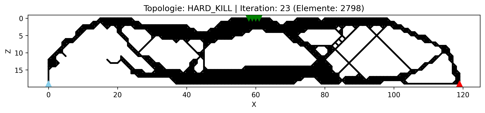
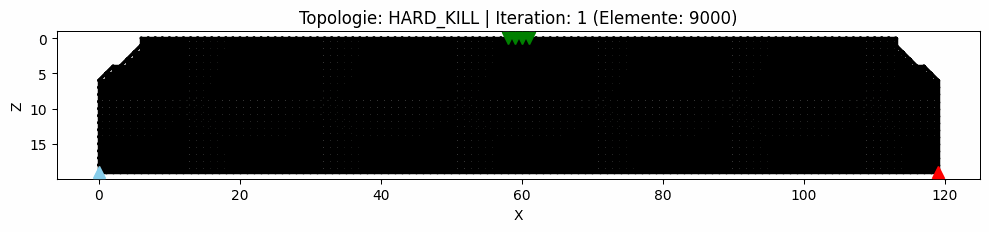
<sub>*Settings: Dimension=120x20; RB: 4x0.1N nach unten in der Mitte, Loslager Links, Festlager Rechts; Masserverhältnis=0.4, Max It 100*</sub>


## ESO_Softkill_Optimizer: Evolutionary Structural Optimization SoftKill Optimizer


### Funktionsweise

Dieser Algorithmus ist eine Weiterentwicklung des **ESO-Hard-Kill-Optimizers** und zielt darauf ab, dessen numerische Schwächen zu beheben sowie durch einen räumlichen Filter natürlichere Strukturen zu erzeugen.
Anstatt ineffiziente Knotenpunkte vollständig zu löschen, werden die Verbindungen derer iterativ Abgeschwächt: Das Material wird über einen sehr geringen Dichtefaktor (z.B. $10^{-4}$) lediglich künstlich „weich" gemacht.
Da die Dimension der Steifigkeitsmatrix $K$ dabei konstant bleibt, werden Singularitäten beim Lösen des Gleichungssystems $K \cdot u = F$ und daraus resultierende Solver-Abstürze effektiv verhindert. Der Nachteil davon ist, dass die Matrixgröße mit steigender Interationszahl nicht sinkt, damit und durch die Filtervorbereitung ergibt sich eine etwas längere Berechnungszeit.

# Beispiel Messerschmitt mit Bölkow–Blohm Balken
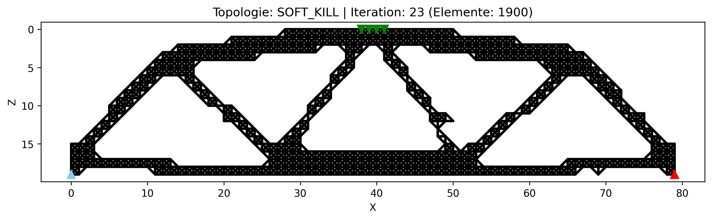 
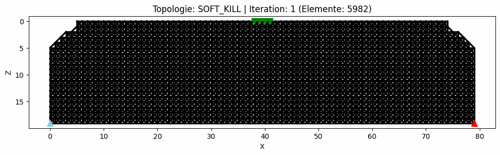
<sub>*Settings: Dimension=80x20; RB: 4x0.1N nach unten in der Mitte, Loslager Links, Festlager Rechts; Masserverhältnis=0.4, Max It 40, Filter-Radius 1.50*</sub>

## SIMP_Optimizer: Solid Isotropic Material with Penalization


## Disclaimer

Dieser Algorithmus ist mit Abstand der komplexeste und liefert auch die plausibelsten Ergebnisse. Es sei erwähnt, dass bei der Entwicklung dieses Algorithmus stark auf Künstliche Intelligenz gesetzt wurde. Trotzdem haben sich beide Entwickler (Mathias Außerlechner und Nils Walser) intensiv mit dem mathematischen Hintergrund, mit Stift und Papier als auch mit der Implementierung in Python, auseinandergesetzt. Es wurden trotz KI-Einsatz viele Stunden in die Verbesserung und Auseinandersetzung investiert. Es sei auch Joachim Spitaler erwähnt, mit dem sich viele Stunden über die SIMP-Methode ausgetauscht wurde.

## Funktionsweise
Das Ziel ist, eine Materialverteilung zu finden die bei gegebenen Lasten die Steifigkeit maximiert, unter der Nebenbedingung eines festen Materialbudgets. Jedem Element $e$ wird eine kontinuierliche Dichte $\rho_e$ als Variable zugewiesen. Formal:

$$ \text{minimiere:} \qquad C = F^T \cdot u \qquad \text{über $\rho$, unter den Bedingungen:} \quad K(\rho) \cdot u = F, \quad \sum_e \rho_e \cdot v_e \leq V_{Ziel}$$

wobei $C$ die Compliance (globale Nachgiebigkeit), $F$ der Kraftvektor, $u$ der Verschiebungsvektor, $K$ die Steifigkeitsmatrix und $V_{target}$ das Zielvolumen ist. Die Volumenbeschränkung koppelt alle Variablen, das Problem lässt sich nicht elementweise lösen, sondern erfordert ein globales Optimierungskriterium.

Da eine kontinuierliche Dichte physikalisch unsinnige Zwischenwerte erzeugt, werden diese durch das Potenzgesetz $E_e(\rho_e) = \rho_e^p \cdot E_0$ abgeschwächt, wobei $E_0$ der Elastizitätsmodul des Vollmaterials und $p$ der schrittweise erhöhte Penalty-Faktor ist. Zwischendichten werden dadurch strukturell unattraktiv und der Algorithmus treibt $\rho_e$ implizit gegen $\rho_{min}$ oder $1$.

Nach jedem Lösen von $K \cdot u = F$ wird berechnet, wie wertvoll Material an jeder Stelle ist, das wird anhand der Ableitung der Compliance nach der Elementdichte beurteilt:

$$\frac{\partial C}{\partial \rho_e} = -p \cdot \rho_e^{p-1} \cdot u_e^T \cdot K_e^0 \cdot u_e$$

wobei $u_e$ der lokale Verschiebungsvektor und $K_e^0$ die Elementsteifigkeitsmatrix bei Volldichte ist. Um numerische Artefakte zu vermeiden, werden diese Sensitivitäten über einen Radius $r_{min}$ räumlich gefiltert.

Da die Volumenbeschränkung direkt in die Optimierung eingebunden werden muss, wird sie über einen Lagrange-Multiplikator $\lambda$ an die Zielfunktion gekoppelt:

$$\mathcal{L}(\rho, \lambda) = C(\rho) + \lambda \cdot \left(\sum_e \rho_e \cdot v_e - V_{Ziel}\right)$$

$\lambda$ gewichtet dabei wie stark eine Volumenverletzung die Zielfunktion beeinflusst. Die Optimalitätsbedingung $\partial \mathcal{L} / \partial \rho_e = 0$ liefert dann direkt die Update-Regel für jede Dichte:

$$\rho_e^{new} = \rho_e \cdot \left(\frac{-\partial C / \partial \rho_e}{\lambda \cdot v_e}\right)^{0.5}$$

Der Exponent $0.5$ bzw. die Quadratwurzel dient als Dämpfungsfaktor der verhindert, dass die Dichten pro Iteration zu stark springen. 

Im Optimum ist der Steifigkeitsbeitrag pro Volumeneinheit für alle Elemente gleich, kein Element kann durch lokale Umverteilung von Material eine bessere Gesamtsteifigkeit erzeugen.
Die Update-Regel benötigt einen konkreten Wert für $\lambda$, dieser ist jedoch unbekannt und muss so gewählt werden, dass die Volumenbeschränkung nach dem Update exakt erfüllt ist. Da ein größeres $\lambda$ die Dichten senkt und ein kleineres sie erhöht, gibt es genau ein $\lambda^I$ das das Zielvolumen trifft. Dieses wird durch Bisektion gefunden: Der Algorithmus definiert ein weites Startintervall für $\lambda$ und halbiert es iterativ, bis $\lambda^I$ mit ausreichender Genauigkeit bestimmt ist. Der Prozess iteriert bis die maximale Dichteänderung erreicht ist.

# Beispiel mit Messerschmitt Bölkow–Blohm Balken
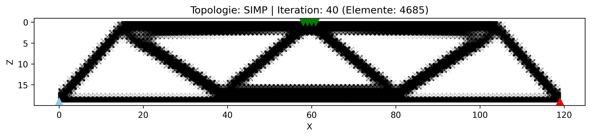 
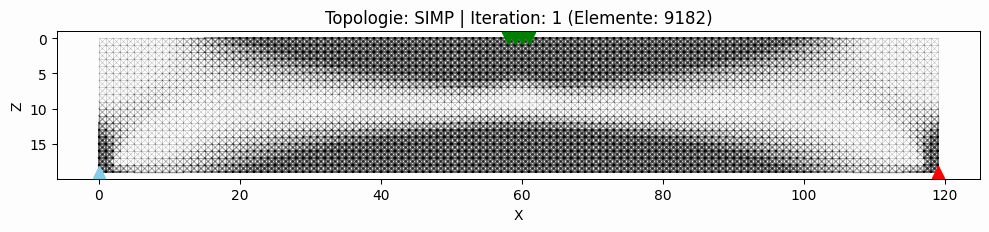
<sub>*Settings: Dimension=120x20; RB: 4x0.1N nach unten in der Mitte, Loslager Links, Festlager Rechts; Masserverhältnis=0.4, Max It 40, Filter-Radius 1.50, Max Penalty 3.0*</sub>

## Ergebnisse
Verformung der ESO Hardkill Optimierung:
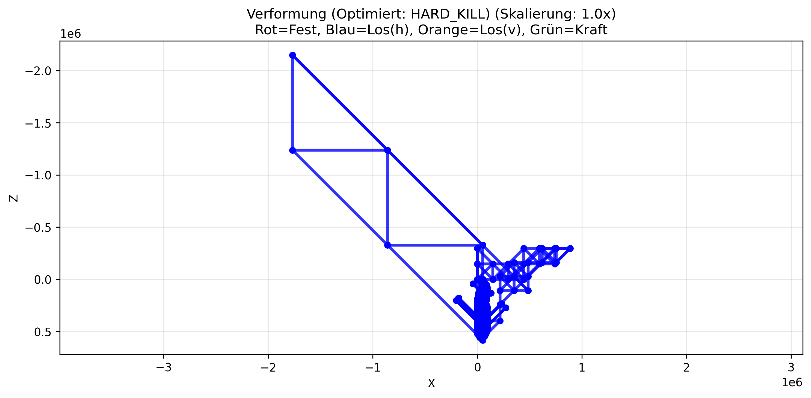

Verformung der ESO ESO Softkill Optimierung:
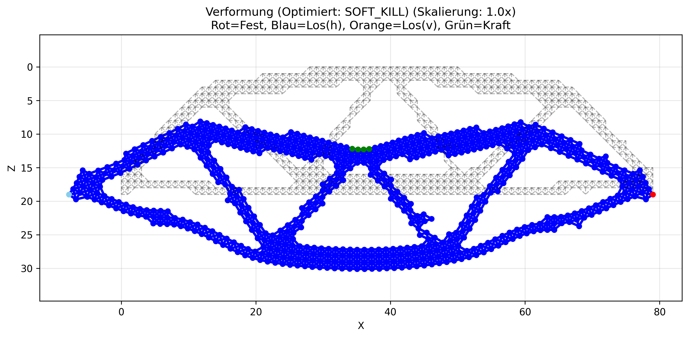

Verforumg der SIMP Optimierung:
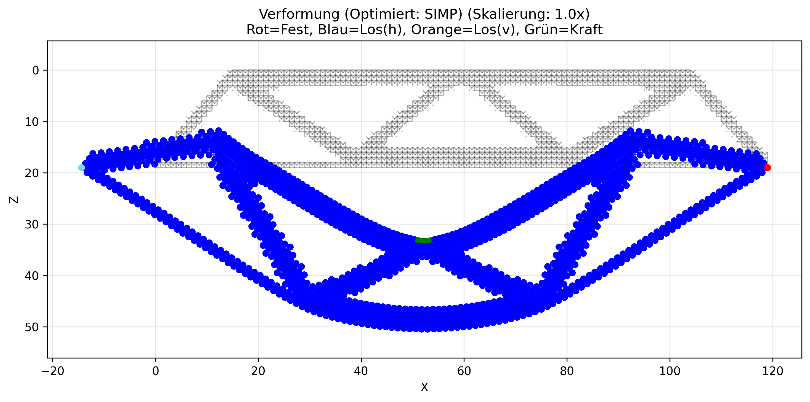

Verformung der nicht optimierten Struktur:
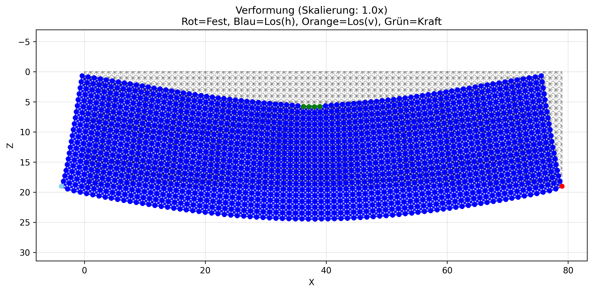

## Kurzüberblick zu implemetierten Features

### Minimalanforderungen
* Eine Python-Anwendung mit Web-UI (streamlit) soll entwickelt ☑️
werden
* Darin kann die Topologieoptimierung beliebiger 2D-Strukturen mit ☑️
unseren Einschränkungen durchgeführt werden
* Die Ausgangsstruktur soll definiert werden können: 
- Ursprünglicher Bauraum als Rechteck mit Breite & Höhe ☑️
- Randbedingungen (Loslager, Festlager) an Massepunkten ☑️
- Externe Kräfte an Massepunkten ☑️
* Visualisierung der Struktur vor, während & nach der Optimierung
inkl. der Verformung ☑️
* Die Struktur inkl. Randbedingungen, etc. kann zu jedem Zeitpunkt
gespeichert und wieder geladen werden → Fortsetzung der
Optimierung möglich ☑️
* Lösung des Problems erfolgt in gedanklicher Anlehnung an die
Finite Elemente Methode (FEM) → so wie oben vereinfacht
beschrieben ☑️
* Es muss verifiziert werden, die Struktur nicht "auseinander fällt"
durch die Optimierung ☑️
* Testen der Implementierung am Beispiel des Messerschmitt
Bölkow–Blohm (MBB) Balken → in Dokumentation zeigen ☑️
* Die optimierte Geometrie kann als Bild heruntergeladen werden ☑️
* Die Anwendung soll mit streamlit deployed werden ☑️

### Erweiterungen
* 2 zusätzliche Optimierungs-Algorithmen ⭐
* Optimierer-Einstellungen können vom User konfiguriert werden ⭐
* Bilder können hochgeladen und in Strukturen konvertiert werden ⭐
* Strukturen können direkt in der UI gezeichnet werden ⭐
* Der Optimierungsverlauf kann als GIF heruntergeladen werden ⭐
* Die UI wurde aufwendig gestaltet ⭐
  - Auswahl von Randbedingungen mit Werkzeugpipette ⭐
  - Live-View für Balkendimensionen ⭐
  - Möglichkeit nur die Verformung zu berechnen ⭐
  - Logischer und übersichtlicher Aufbau ⭐
  - Unterstützung für Winkel von Kräften und vertikale Loslager ⭐
* Speicherung von Projekten über `.npz` Dateien ⭐
* Sorgfältige Programmstrukturierung ⭐
  - Ineinandergreifender Klassenaufbau: `Elements` ← `Structure` ← `StructureBuilder` ⭐
  - Getrennte Ordner und Dateien als Pakete (siehe UML) ⭐
  - Vererbungshierarchie bei den Optimierern ⭐
  - Wenig redundanter Code, insbesondere in `\core` ⭐
* Sehr ausführliche Dokumentation durch README.md ⭐
  - UML Diagramme, Ausfühliche Erklärungen (UI, Algorithmen, ...) ⭐

## Autoren
Mathias Ausserlechner, Nils Walser

Im Rahmen des Projekts wurden zusätzlich KI-gestützte Werkzeuge unterstützend zur Fehleranalyse und Recherche eingesetzt

